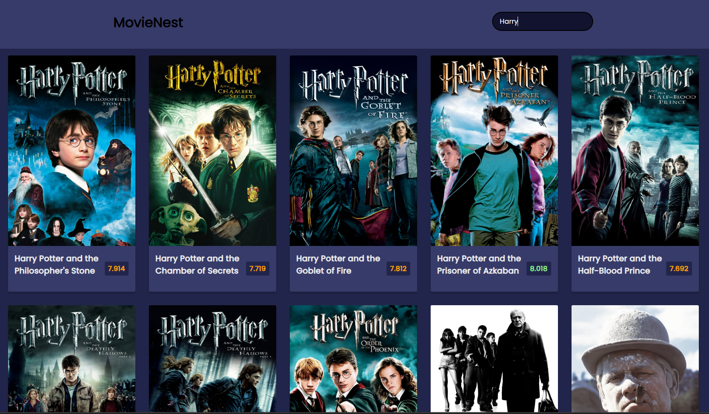

# MovieNest

A web-based application that fetches and displays popular movies using The Movie Database (TMDb) API. The application allows users to search for movies and view details such as title, poster, rating, and overview.



## Features

- **Fetch Popular Movies**: Displays a list of popular movies retrieved from TMDb API.
- **Search Functionality**: Allows users to search for movies by title.
- **Movie Details**: Shows movie poster, title, rating, and overview.
- **Responsive Design**: Ensures a seamless viewing experience across different devices and screen sizes.

## Demo

Check out the live demo: [Demo Link](https://mkraj-7838.github.io/MovieNest/)

## Installation

To get a local copy up and running, follow these simple steps:

1. **Clone the repo**
    ```sh
    git clone https://github.com/your-username/MovieNest.git
    ```

2. **Navigate to the project directory**
    ```sh
    cd MovieNest
    ```

3. **Open `index.html` in your browser**

## Usage

1. Open the `index.html` file in your preferred web browser.
2. The application will automatically display a list of popular movies.
3. Use the search bar to find movies by title.
4. Click on any movie to view more details.
